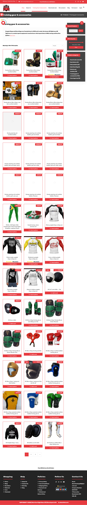
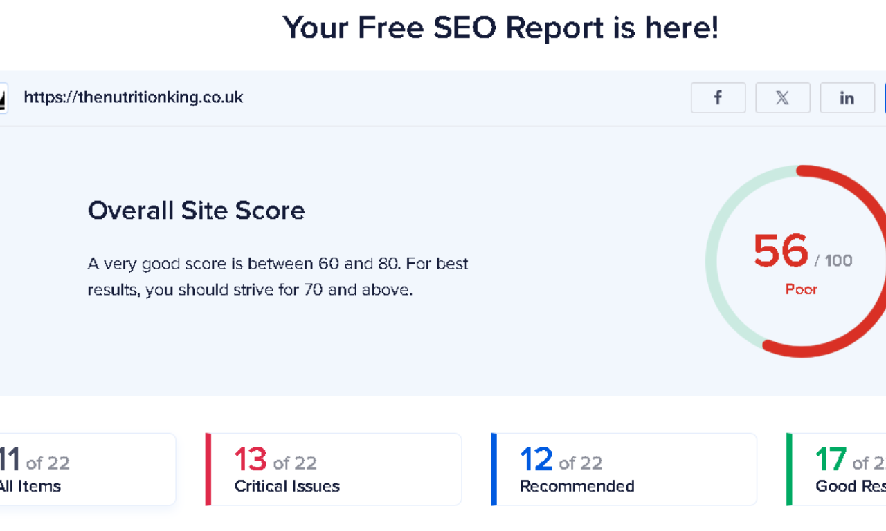
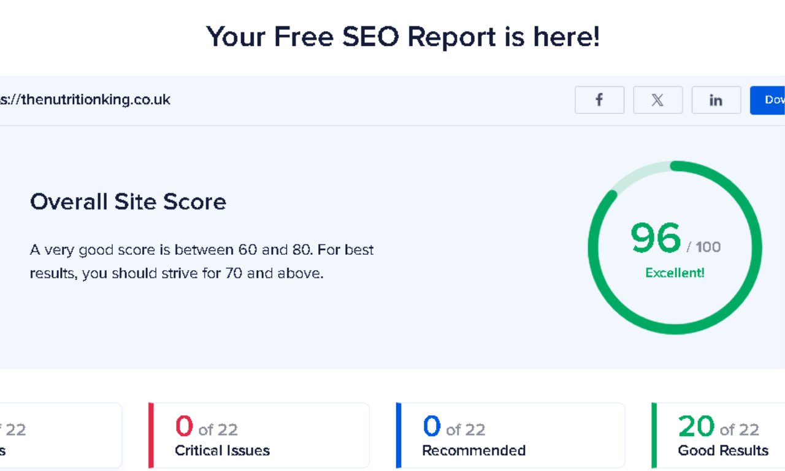
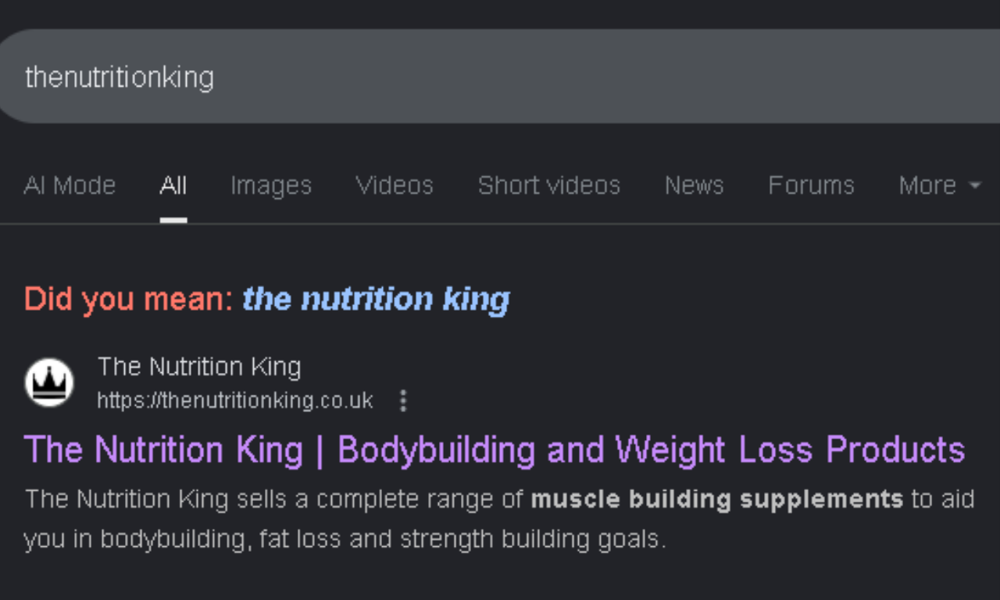
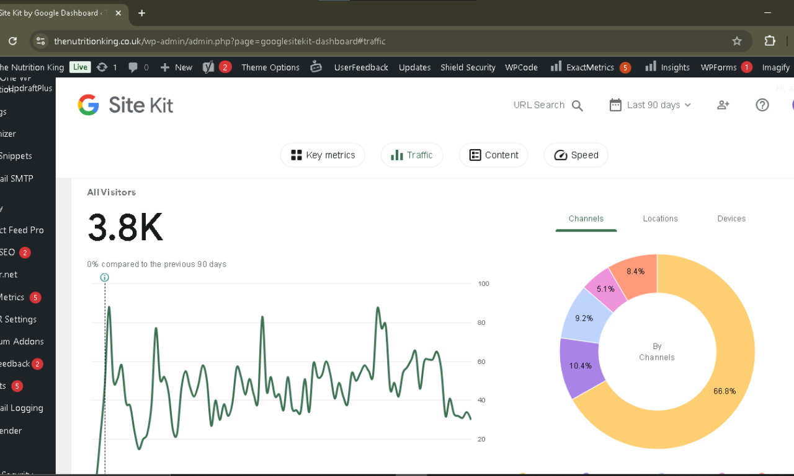

# The Nutrition King - WordPress eCommerce Store + SEO Optimization 🏆

📋 **Project Overview**

This is a professional eCommerce website developed for **The Nutrition King**, a UK-based supplement and bodybuilding nutrition brand. The client needed a complete online store to sell their Beastmode Labs supplement line and training accessories. I designed and built the entire website using **WordPress, Elementor, and WooCommerce**, and later took on the **on-page SEO** to fix the site's technical issues and improve its search visibility.

🌐 **Live Website:** This project is built on WordPress and is currently live. You can visit the actual store here: [https://thenutritionking.co.uk](https://thenutritionking.co.uk)

🚀 **Built By**

**Sohaib Younas** - Full Stack Web Developer & SEO Specialist

## 👨‍💻 About Me:

I hold a Bachelor's degree in Computer Science and currently work as a Police Station Assistant (PSA) in Punjab Police, where I handle data entry and administrative tasks. Alongside my job, I continue to grow my freelancing career with dedication and professionalism.

I am a Web Developer and SEO Specialist with 4+ years of experience, specializing in WordPress, Elementor Pro, WooCommerce, Shopify, HTML5, CSS3, PHP, and on-page SEO. I've successfully delivered projects for clients across the US, UK, Singapore, Romania, and Finland, working with software companies and freelancing on platforms like Upwork, Fiverr, and LinkedIn. My expertise ensures the creation of high-quality, responsive, and search-friendly websites tailored to meet client needs.

---

## 📋 About Project:

### 🎯 Client Demands

- **Platform:** WordPress + WooCommerce
- **Primary Request:** A complete, ready-to-sell online store for their Beastmode Labs supplement line and training accessories
- **Design Preference:** Bold, energetic design matching a fitness/bodybuilding brand
- **Scope:** Full product catalog setup, checkout flow, and on-page SEO optimization
- **Purpose:** Convert visitors into customers and rank on Google for relevant supplement-related searches

### 💼 Project Phases

This project was completed in two phases:

**Phase 1 - Website Design & Development**
- Built the entire store using WordPress, Elementor, and WooCommerce
- Organized a large product catalog (supplements, apparel, accessories) into clear categories
- Set up pricing, product variations, and a working cart and checkout flow
- Designed bold product banners and category sections for each product line

**Phase 2 - SEO Optimization**
- Audited the site using Yoast SEO and identified 13 critical issues
- Optimized meta titles, meta descriptions, and content structure
- Fixed technical SEO issues to improve overall site health
- Verified ranking improvements through Google Search

### 🚀 Technical Delivery

- **CMS:** WordPress
- **Page Builder:** Elementor
- **eCommerce:** WooCommerce
- **SEO Plugin:** Yoast SEO
- **Design:** Bold, conversion-focused UI for a fitness/supplement brand
- **Responsive:** Mobile-first approach

---

## 📸 Screenshots

### Website Design

| Homepage | Shop Page | Training Gear & Accessories |
|---|---|---|
|  |  |  |

### Website Design

**Homepage Preview:**

**Shop Page:**

**Training Gear & Accessories Page:**

### SEO Results

**Before SEO Optimization - Score: 56/100 (Poor)**

**After SEO Optimization - Score: 96/100 (Excellent)**

**Google Search Ranking - #1 for Brand Name:**

**Traffic Growth After SEO Implementation:**

---

🤝 **Let's Work Together**

I specialize in building websites that don't just look good — they convert and rank. Whether you need a WooCommerce store, a WordPress website, or on-page SEO to fix an underperforming site, I can help bring measurable results to your business.

## 📩 Contact

Want to hire or collaborate with me? Feel free to reach out:

- 🌐 **Portfolio:** [https://sohaibyounas076.github.io/portfolio/](https://sohaibyounas076.github.io/portfolio/)
- 💼 **Fiverr:** [https://www.fiverr.com/s/VYxqN3e](https://www.fiverr.com/s/VYxqN3e)
- 🧑‍💼 **Upwork:** [https://www.upwork.com/freelancers/~011817cb8d8d27e8a6](https://www.upwork.com/freelancers/~011817cb8d8d27e8a6)
- 🔗 **LinkedIn:** [https://www.linkedin.com/in/sohaibyounas076/](https://www.linkedin.com/in/sohaibyounas076/)
- 📧 **Email:** sohaibyounas077@gmail.com

This project was developed as a client order, demonstrating my ability to deliver both professional web design and measurable SEO results.
